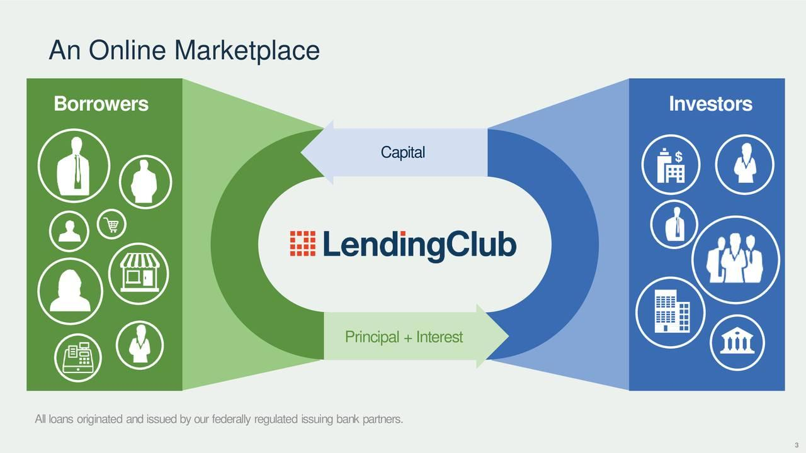

# Data Science Portfolio
---
## Machine learning

### Lending Club Case Study

Lending Club is a set of processes and analyses that allow businesses to identify which loans applicantions are risky and have a higher chance of default.

